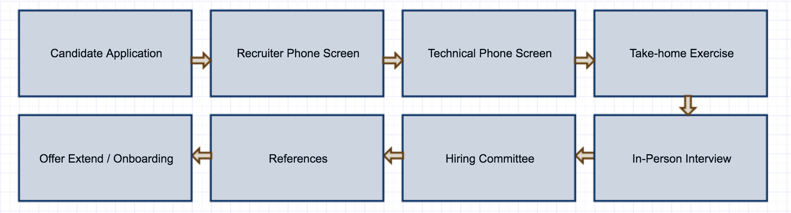

# Open Interview Process

- [Getting Started](#getting-started)
- [Interview Process and Timeline](#interview-process-and-timeline)
- [For Candidates - Applying to Avero](#for-candidates---applying-to-avero)
- [Exercise Based Interview Challenges](#exercise-based-interview-questions)
- [Contributing to the Interview Process Guide](#contributing-to-the-interview-process-guide)

## Welcome to the Avero Engineering Interview Process
At Avero, we are exploring new ways to structure our interview process to create familiarity for candidates resulting in a better candidate experience and hiring decisions. We focus on assessing the skills you’ll use in your role with exercise based interviews. 

**Why are we opening the interview process?**

- **To help candidates feel prepared:** If you spend the time to research Avero and our interview process, we will be thrilled.  We think that if candidates spend the time to prepare for engaging discussions with the team, they will be ready to do the same when they join the team! 

- **To simply be transparent:** We want to encourage engineers, recruiters, and everyone involved in the hiring process to be absolutely candid. We want candidates to get a realistic preview of what’s to come in their role at Avero by setting up relevant simulations and scenarios.

- **To have a conversation.** We encourage candidates to ask any questions and communicate assumptions in attempting the coding exercises. We welcome feedback on our interview process and encourage anyone reading this to contribute your ideas to our process as well!

## Getting Started

The following content will provide candidates with valuable information. 

**For Candidates:**

- You will leave with a thorough understanding of the engineering interview process at Avero, along with visibility into real questions from our onsite interviews. Our recruiters will be happy to confirm which of these questions will be presented during the onsite interview. 

- Please note, around 10-20% of each interview is spent on a curve-ball question that we do not include in the exercises. While you can come prepared for a majority of the interview, we also like to see how you think on your feet.

## Interview Process and Timeline

#### Overview

We aim to have our interview process take an average of 3 weeks from start to finish.  Between each step of the interview process, we ask for at most 3 business days for us to to make a decision, but at any point during the interview process, please feel comfortable reaching out to us for updates on your candidacy. 

1. **Candidate Application Review:** The recruiter for the position will do the first round of evaluations and review application submissions. If more information is required, a member of the team will reach out to the applicant directly. Candidates that are disqualified at this stage will be notified by the recruiter.

2. **Recruiter Phone Screen:** If the candidate qualifies for the role, the recruiter will send an availability request for a 30-minute call to explore their background and experience. Depending on the outcome of the screening call, the candidate will either be rejected or proceed to a technical phone interview or a take-home exercise.

3. ** Phone and/or Interview Take-home Exercise **

    - **Phone Interview:** The 30-minute phone interview with a member of the team covers skills related to the specific role. Provides techincal expectations and how we work as a engineering team. We give the candidate a chance to ask a team member questions.

    - **Take-home Exercise:** The take-home exercise typically takes 2-6 hours to complete and allows the hiring manager or a memeber of the team to review a candidate’s skills before proceeding to the next step of the hiring process. The take-home exercise.  

4. **In-person Interviews:** The next step in the interview process is an onsite interview. The onsite interview team consists of people that would be on the candidate's direct team and people on cross-functional teams too. The recruiter will share an overview of who the candidate will be meeting with. The interview itself will including additional techinical probing and discussing the take-home exercise, with a break in the middle for lunch with a member of the team. Each session runs an hour long, including lunch, which is a time for candidates to take a break, relax, and get a feel for our culture at Avero. 

5. **Hiring Committee Review:** After the onsite interview is complete, feedback from the interview process is shared across the interview team. Interview team members review the feedback and independently reach a decision of hire/no-hire based on the comprehensive feedback. At the HC review, the interview team reaches a consensus on whether to reject the candidate or proceed with reference calls.

6. **Reference Calls:** The recruiting team will make reference calls for promising candidates. At a minimum, two reference calls will be completed.  One should be a candidate's manager and the other someone someone who has worked directly with the candidate and can speak to their past work. 

7. **Final Review:** After successful reference calls, the recruiter submits the employee packet to the CEO and Hiring Manager for final approval.

8. **Offer Extend:** The recruiter will reach out to the candidate to schedule time to connect and extend the formal offer. Initially, this is done verbally but is always followed by the written offer as described in the section on preparing offers. The Hiring Manager and interview team follows-up to answer any questions that the candidate may have, which will hopefully lead to the candidate accepting the offer.

9. **Offer Accept/Onboarding:** If the candidate accepts the offer, the onboarding process begins. 

## For Candidates - Applying to Avero

The best way to apply for positions with Avero is directly through our careers page, where we list all of our open roles. If there are no roles open please check back with us in the future as we continue to grow. 

To apply to Avero:

1. Go to our [careers page](http://www.averoinc.com/about/view/careers).

2. See our list of open [Engineering roles](https://jobs.lever.co/averoinc?team=Engineering). 

3. If the role sounds interesting to you, fill out the application form at the bottom of the page, then click the "Submit Application" button.  

## Exercise Based Interview Challenges

The purpose of an interview is to obtain information about a candidate in order to predict future performance. To accomplish this, we rely on Exercise-Based Interviewing. Exercise based interviews can include case studies, individual exercises, or presentations. They allow for our interviewers to witness the direct application of a candidate’s abilities to competencies required for the role. Rather than guess if a candidate can do the job based on their answers to behavioral questions, we ask for candidates to show. During the interview, candidates are asked to complete exercises that are similar to the initiatives they would complete when actually working in the position on a day to day basis.

For engineering positions, we use coding and system design questions.

For more information about the different exercises we use in our interview process, please review the different exercise below. 

- [Frontend Coding Exercise Exercise](https://github.com/AveroLLC/check-api)

- [Backend Coding Exercise](https://github.com/AveroLLC/reporting-api-exercise)

## Contributing to the Interview Process Guide

If you’d like to contribute an interview exercise, please follow the template below, then either submit a pull request on the correct file.

**Interview Exercise Template:** 

**Title:** 

- **Overview:** 

- **Set-up:** 

- **Part 1:** 

- **Part 2:** 

- **Considerations:** 

- **Follow-up Question:** 

- **Prompts (if any)**

- **[Not included] Curveball Question:** The curveball portion should be an extension of the interview that shows how the candidate thinks on their feet. This portion is not shared with candidates as we want to evaluate how they respond to a problem to find a solution.